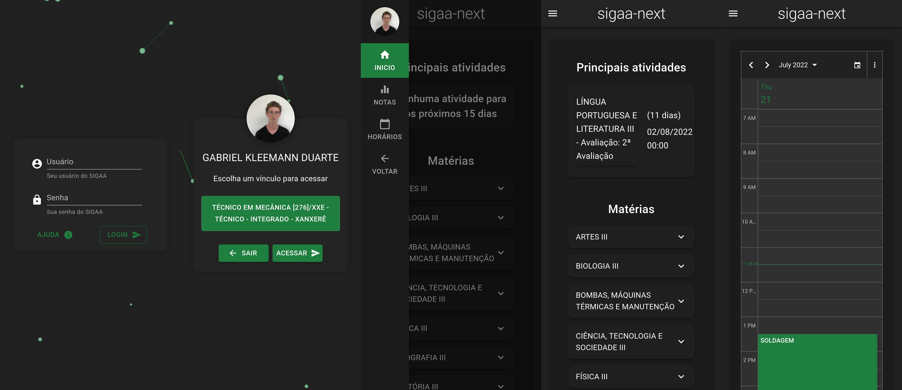

### Este projeto está hospedado em [sigaa-next-client.vercel.app](https://sigaa-next-client.vercel.app/).  

## Disclaimer

O código em si, integra a sigaa-socket-api a qual integra a [sigaa-api](https://github.com/GeovaneSchmitz/sigaa-api)
que é uma biblioteca Web Scraping, feita para acessar o [SIGAA](https://sigaa.ifsc.edu.br) (Sistema Integrado de Gestão de Atividades Acadêmicas) e retirar dados e retornar para o usuário.

Este projeto foi desenvolvido com base nas informações apresentadas em acessos realizados no SIGAA. Por isso pode ocorrer incompatibilidades entre os dados mostrados no SIGAA e os dados apresentados no site.
 
Qualquer dúvida, entre em contato. 
Email: gabrielkduarte234@gmail.com  
Ou abra uma [issue](https://github.com/dduartee/sigaa-next-client/issues/new) no GitHub.

 

