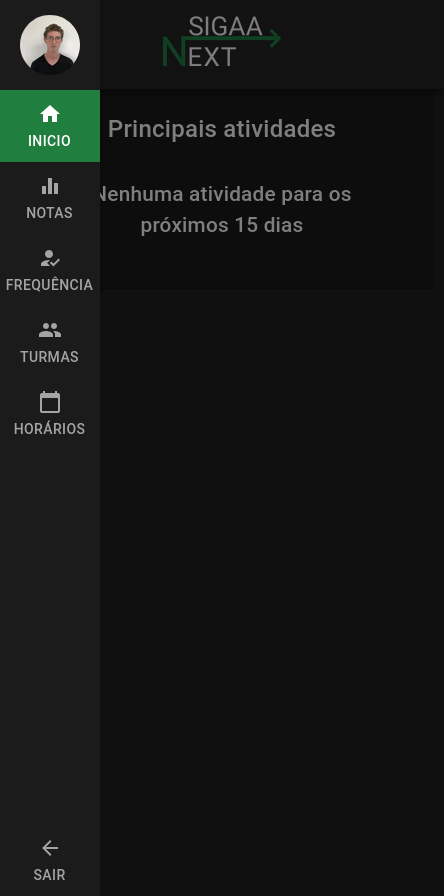
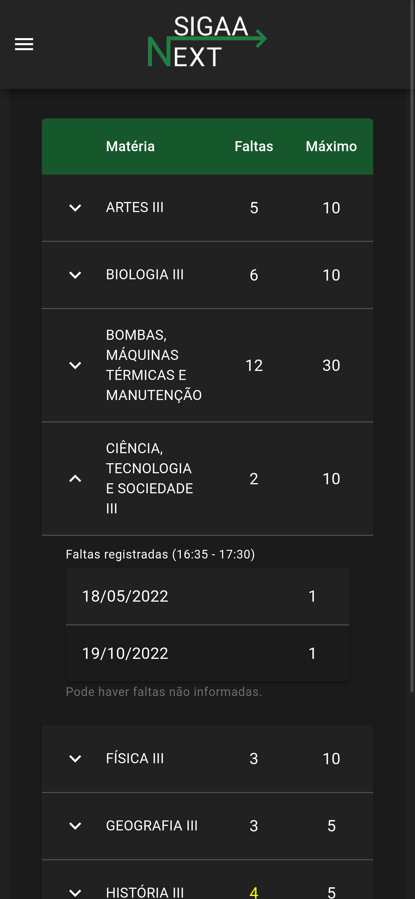
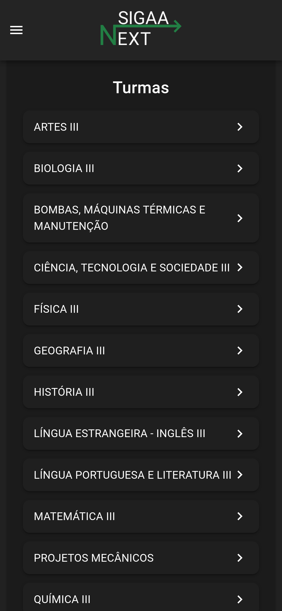
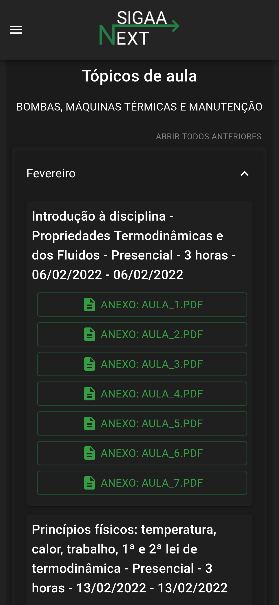
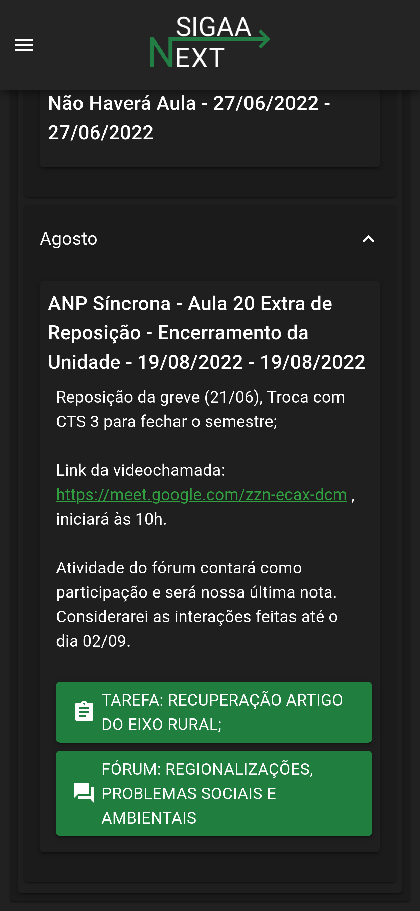

### Este projeto está hospedado em [sigaa-next-client.vercel.app](https://sigaa-next-client.vercel.app/).  

### Link do trabalho apresentado:  [Alternativa ao SIGAA para visualização de informações "gerais" pelos estudantes](https://www.even3.com.br/anais/encontro_emi_ifsc/519811-alternativa-ao-sigaa-para-visualizacao-de-informacoes-globais-pelos-estudantes/).   <a href="docs/images/519811.pdf">(Trabalho em pdf)</a>

## Objetivo do projeto

O principal objetivo do projeto é melhorar a usabilidade do estudante para visualizar as informações do SIGAA, como por exemplo, todas as notas de todas as matérias em uma única página, horários, tarefas e além de outras funcionalidades que serão implementadas, como visualização de frequências, tópicos de aula, arquivos, entre outros.
 

## Uso dos dados

Ao utilizar o [backend](https://github.com/dduartee/sigaa-socket-api), os dados, leia-se as informações do usuário (nome, usuário, url da foto), informações de vinculos e turmas, são armazenadas temporariamente para agilidade na resposta, bem como para as informações que podem ser compartilhadas entre usuários com as mesmas permissões para a turma, os tópicos de aula e o conteúdo da tarefas.

Sobre as credenciais (Cookie da sessão, e usuário) são armazenados temporariamente para o acesso ao SIGAA. Além disso, para evitar o roubo de sessão, o usuário recebe um código de referência do Cookie salvo na memória do servidor.

Todas as informações armazenadas tem um tempo de vida, que pelo padrão do SIGAA, a sessão dura 90 minutos. Em respostas compartilhadas, o tempo de vida é de 2 dias.

No frontend, informações da sessão são salvas no navegador (sessionStorage), basta fazer o logoff ou fechar a aba que as informações são apagadas.
 

## Segurança em outros softwares

EU não me responsabilizo e nem garanto a segurança de nenhum outro software que utilize da mesma biblioteca [sigaa-api](https://github.com/GeovaneSchmitz/sigaa-api). Visto que, exclusivamente nos repositórios [sigaa-socket-api](https://github.com/dduartee/sigaa-socket-api) e [sigaa-next-client](https://github.com/dduartee/sigaa-next-client), bem como no servidor [api.sigaa-next](https://api.sigaa-next.duckdns.org) de acesso privado e sem permissão de acesso à terceiros, não possuem alteração no código após o commit no GitHub.

## Como contribuir

Para manter o projeto funcionando 24h e atualizado, estamos aceitando doações!

PIX (email): <a href="mailto:sigaanext@gmail.com">sigaanext@gmail.com</a>
 

## Problemas ou sugestões

Caso encontre algum problema ou tenha alguma sugestão, por favor, abra uma issue [aqui](https://github.com/dduartee/sigaa-next-client/issues/new).

 

<h2>Login, Ajuda e Vinculos</h2>

 

<h2>Página inicial e menu</h2>

 

<h2>Horários, Frequências e Notas</h2>

 

<h2>Página de turmas e Tópicos de aula</h2>

