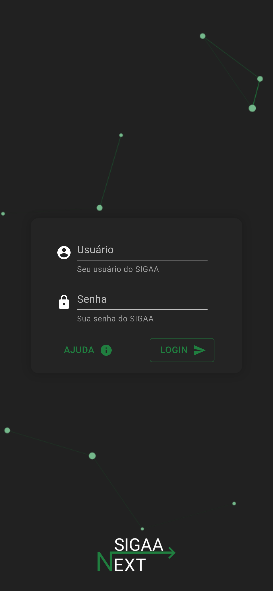

### Este projeto está hospedado em [sigaa-next-client.vercel.app](https://sigaa-next-client.vercel.app/).  

## Objetivo do projeto

O principal objetivo do projeto é melhorar a usabilidade do estudante para visualizar as informações do SIGAA, como por exemplo, todas as notas de todas as matérias em uma única página, horários, tarefas e além de outras funcionalidades que serão implementadas, como visualização de frequências, tópicos de aula, arquivos, entre outros.
 

## Como contribuir

Para manter o projeto funcionando 24h e atualizado, estamos aceitando doações! 

email: sigaanext@gmail.com</h2>
 

## Problemas ou sugestões

Caso encontre algum problema ou tenha alguma sugestão, por favor, abra uma issue [aqui](https://github.com/dduartee/sigaa-next-client/issues/new).

# Páginas
 

## Login, Ajuda e Vinculos

 

## Página inicial e menu

 

## Horários e Notas

